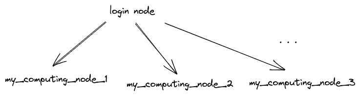

### cluboard

Simplistic web monitor of GPU utilization. Best suited for systems with multiple GPUs and many users. Build upon `gpustat`. 

TODO video here.

Idea of Cluboard is to have all the simple outline of the cluster GPUs availability at a single glance. Current features:

* nodes can be arranged in a grid with the layout defined by a user
* along with GPUs statistics, current CPU + RAM + Swap usage are reported for each node
* top users by GPU usage
* highlighting the users who allocated too many GPUs
* specification of the lab names

The monitor can be an additional tool for clusters equipped with job management systems such as SLURM, IBM Spectrum LSF, etc.

### Installation

Please download the repo from the `master` branch and install the requirements. The commands below will do it for you.

```bash 
git clone https://github.com/seva100/cluboard.git
cd cluboard
pip install -r requirements.txt
```

### Usage

First, please choose a *login node* on your cluster from which all other nodes will be accessible.



As a first step, the config file `config.yaml` needs to be changed. Open it and specify the addresses or IPs of the servers in the `server_names` property. It is a 2D nested list that will correspond to the arrangement of nodes in the Cluboard web page. Please see the comments under each property in the `config.yaml`.

**NB:** make sure that all the nodes can be accessible by the names specified in the `server_names` field from the login node by SSH **without password**. To ensure that, type in the shell at the login node:

```bash
$ ssh one_of_my_servers.com
```

If everything is OK, the shell of the `one_of_my_servers.com` will open. If the password is being asked, make sure to copy the public key to the `one_of_my_servers.com` for the no-password access. On Ubuntu and similar systems, the command `ssh-copy-id one_of_my_servers.com`, executed from the login node, will do that for you.

To launch the monitor, 
```bash
bash gpu_monitor_start.sh [-h] [-p|--port <port>] [-d|--debug] [-c|--config]
```

Options
* `-h`: print help message
* `-p <port>` or `--port <port>`: run monitor on port `<port>`. Default port: 8888.
* `-d` or `--debug`: debug mode. Logs from application will be written to console, and any change of .py files of the project will make it being reloaded automatically. Usually only needed when the files of the project are being modified. 
* `-c` or `--config`: specify the config file if it's different that `config.yaml`.

We recommend to launch Cluboard in one of the session managers, e.g. `screen` or `tmux`, that will not interrupt the session at the logout.

### To be done

* distribution of GPUs per lab
* groups labs by users not by nodes

### PRs

Pull requests & suggestions are much appreciated &mdash; please don't hesitate to open an issue or to contribute. 